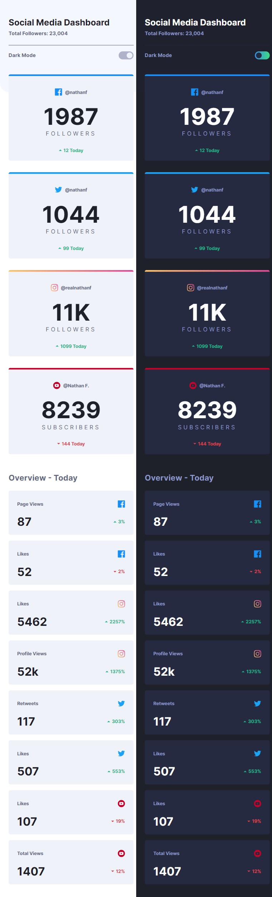
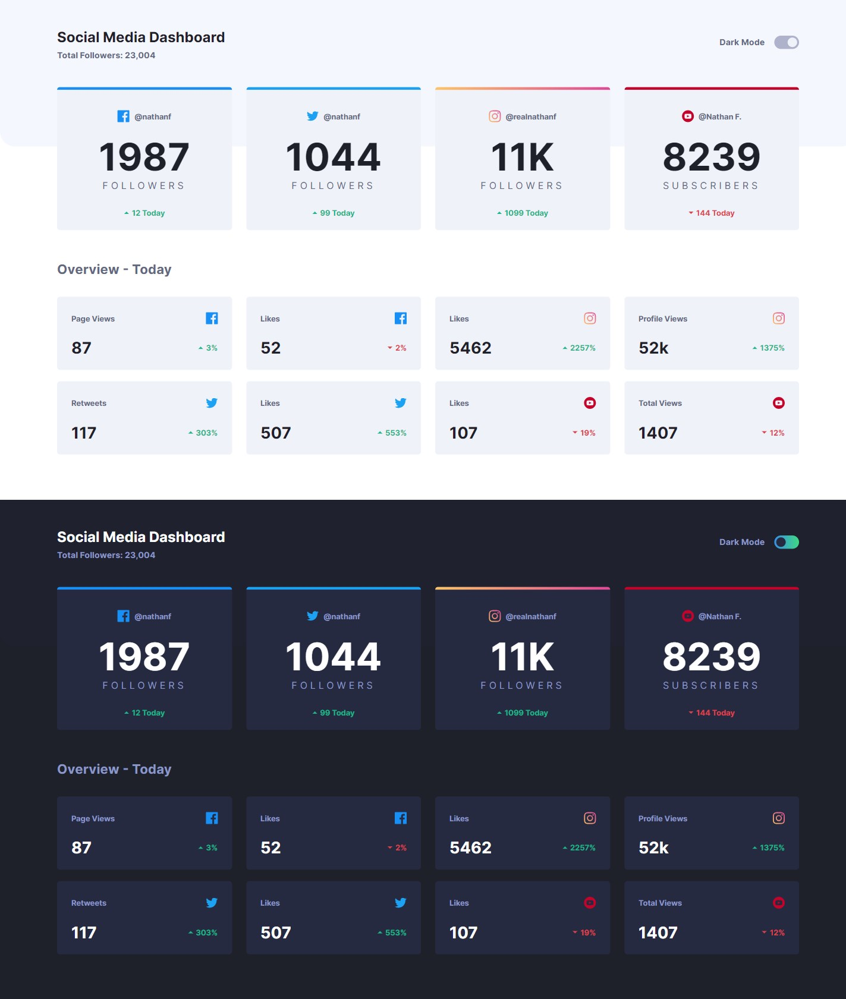
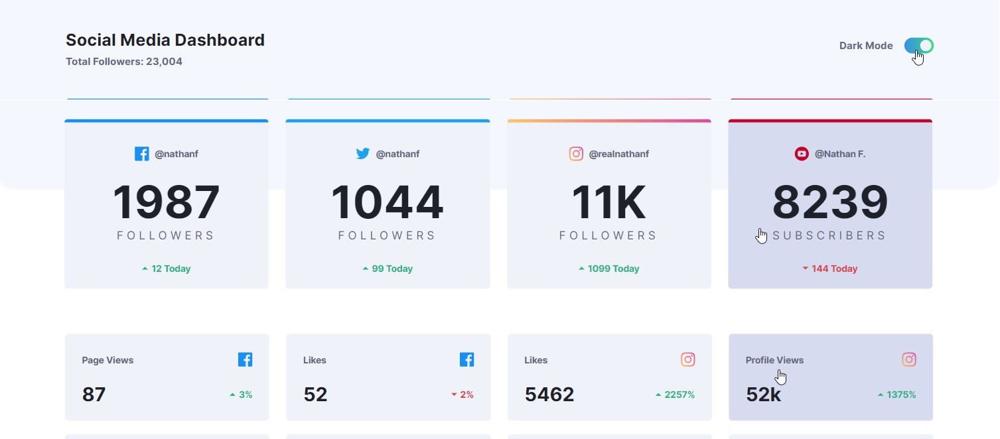
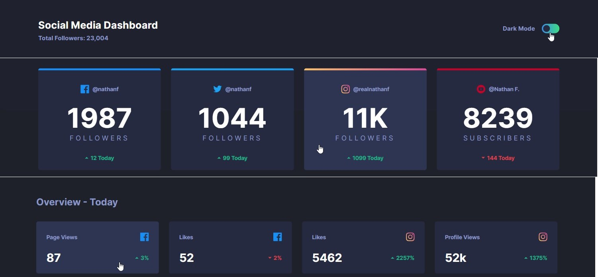

# Social media dashboard with theme switcher solution

This is a solution to the [Social media dashboard with theme switcher challenge on Frontend Mentor](https://www.frontendmentor.io/challenges/social-media-dashboard-with-theme-switcher-6oY8ozp_H). Frontend Mentor challenges help you improve your coding skills by building realistic projects. 

## Table of contents

- [Overview](#overview)
  - [The challenge](#the-challenge)
  - [Screenshot](#screenshot)
  - [Links](#links)
- [My process](#my-process)
  - [Built with](#built-with)
  - [What I learned](#what-i-learned)
  - [Useful resources](#useful-resources)
- [Author](#author)

## Overview


### The challenge

Users should be able to:

- View the optimal layout for the site depending on their device's screen size
- See hover states for all interactive elements on the page
- Toggle color theme to their preference

### Screenshot

- Mobile view both in light and dark themes<br/> 


- Laptop view


- Active states



### Links

- Solution URL: [Frontend Mentor]()
- Live Site URL: [Github](https://amrmabdelazeem.github.io/social-media-dashboard)

## My process

- Set up the project file locally.
- Run ```npx create-react-app``` then ```npm start``` in local console to create the react app.
- Start by setting up the basic structure of the app.
- Add the necessary components for the layout.
- Add root shortcuts for both light and dark themes.
- Add the necessary CSS to style the components.
- Add the necessary JavaScript to handle the color theme toggle.
- Manage active states for interactive components.
- Test the app on different screen sizes.
- Build and Deploy to Github pages.

### Built with

- Semantic HTML5 markup
- CSS custom properties
- Flexbox
- CSS Grid
- Mobile-first workflow
- [React](https://reactjs.org/) - JS library


### What I learned

- Avoid using jQuery with ReactJS as both manipulate the DOM.

```html
<html lang="en" data-theme="light">
```
```css
html[data-theme="light"]{}
html[data-theme="dark"]{}
```
```js
document.querySelector("html").setAttribute("data-theme", "dark");
```


### Useful resources

- [ReactJS](https://reactjs.org/) - JS library

## Author

- Website - [Github](https://github.com/amrmabdelazeem)
- Frontend Mentor - [@amrmabdelazeem](https://www.frontendmentor.io/profile/amrmabdelazeem)